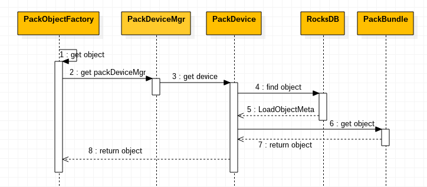
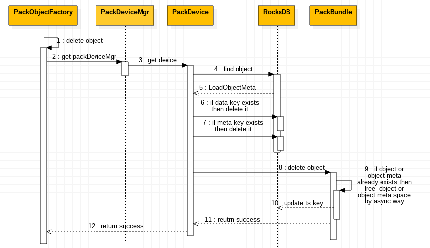
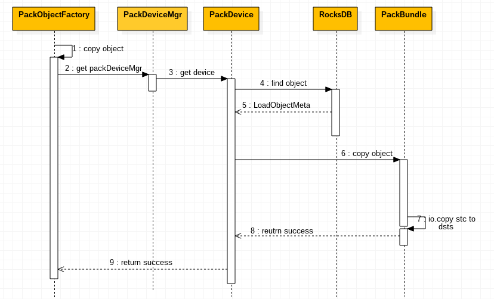

#### OBJECT PUT/GET/POST/DELETE/HEAD/COPY

***

在对对象GET/PUT/POST/DELETE/HEAD/COPY操作时，都会先使用LoadObjectMeta(packObject)函数填充PackObject结构体。PackObject结构体记录该对象文件是否已经存在以及如果存在，则加载该对象文件的具体信息。PackObject结构体如下

```go
type PackObject struct {
	meta     *ObjectMeta //如果ts key存在，则保存该key的value
	metadata map[string]string 
	name      string // 对象名
  	key       string // 格式为partition/hash[29:32]/hash
	exists    bool   // 对象是否已经存在
	partition string // 对象所在的分区
	device    *PackDevice //使用它来操作rocksDB和bundles
	buf       *bytes.Buffer //用来保存对象数据
	dataSize  int64  //对象数据大小
	dataIndex *ObjectIndex //如果db中data key存在，则dataIndex=value.objectIndex。它是记录对象在volume中的位置
	metaIndex *ObjectIndex //如果db中meta key存在，则metaIndex=value.objectIndex。它是记录对象Meta在volume中的位置。
	dMeta *ObjectMeta //和dataIndex配合使用，保存object的元数据
	mMeta *ObjectMeta //和metaIndex配合使用，保存object meta的元数据
}
```

下面看下dMeta和mMeta具体指的什么


volume.data中object file分为两类，一类是通过put提交的，另一类是post提交的。根据Openstack swift官方API文档，put是创建对象或者替换对象操作，post是更新对象元数据操作(序列图见下图)。put提交的object暂且就叫data needle，post提交的obejct meta暂且就叫meta needle。合并存储引擎是以volume.data末尾追加的方式创建对象。当替换对象时，如果在原来对象磁盘空间上修改数据，则可能会覆盖其他对象，所以替换对象也是通过追加的方式在volume.data末尾重新创建对象；原来对象占用的磁盘空间以4k对齐通过[punch hole](http://manpages.courier-mta.org/htmlman1/fallocate.1.html)方式被回收。同理，当更新对象元数据时，如果直接在data Needle修改meta也可能会造成下一个对象数据被覆盖。所以，当post object时，PackEngine则会在volume.data末尾追加meta needle数据，RocksDB中会创建或者更新key，key=/partition/hash[29:32]/hash/meta，value.ObjectIndex跟NeedleHeader功能相似，value.objectMeta存储的是meta needle 的mMeta。所以在对象真正的存储前，先使用LoadObjectMeta(packObject)函数填充PackObject结构体，以记录该对象的状态信息。通过索引数据库，如果对象存在则packObject.exists=true，否则为false。如果ts key 存在，即对象已经被删除，则packObject.meta = ts key =>value.objcetMeta；如果data key存在，即对象存在，则packObject.dataIndex = data key -> value.objectIndex，packObject.dMeta = data key -> value.objectMeta；如果Meta key存在packObject.metaIndex = meta key -> value.objectIndex，packObject.mMeta = meta key -> value.objectMeta。
###### 1. GET OBJECT



根据PackObject.dataIndex，取出对象数据。

###### 2. PUT OBJECT


如果对象已经存在，先删除数据库中的ts key，meta key。然后根据PackObject.dataIndex，PackObject.metaIndex异步回收volume.data中的对象数据，同时在volume.data末尾创建对象，并更新数据库。
###### 3. POST OBJECT


如果对象meta已经存在，则根据PackObject.metaIndex异步回收volume.data中的对象数据，同时在volume.data末尾创建对象 meta，并更新数据库。

###### 4. DELETE OBJECT



先删除数据库中的data key，meta key。根据PackObject.dataIndex，PackObject.metaIndex异步回收volume.data中的对象数据。同时，在数据库中创建ts key。

###### 5. HEAD OBJECT


根据PackObject.metaIndex，取出对象元数据。

###### 6. COPY OBJECT



根据PackObject.dataIndex取出voluem.data中的对象并复制对象数据到dsts。