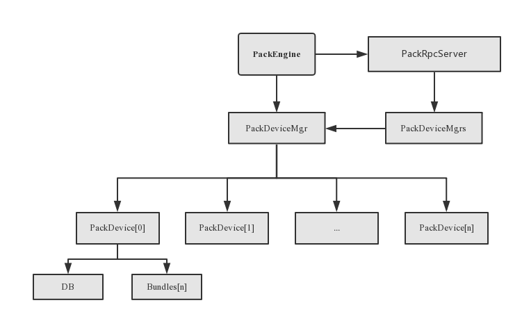

### PackEngine设计

***

首先PackEngine会初始化PackDevicesMgr对象，PackDevicesMgr负责管理对应storage-policy下所有PackDevice列表，每个PackDevice负责管理device下的所有的Bundles列表和DB，每个Bundle负责管理partition。然后PackEngine初始化PackRpcServer对象，将PackDevicesMgr注册到PackRpcServer对象中的PackDevicesMgrs字典中。类图如下图所示

用例图如下

