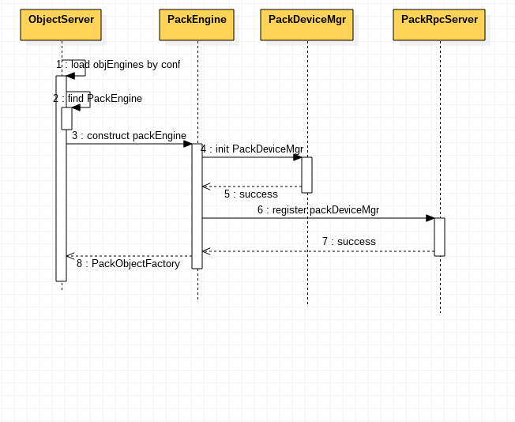

### PackEngine代码设计
***


首先PackEngine会初始化PackDevicesMgr对象，PackDevicesMgr负责管理对应storage-policy下所有PackDevice列表，每个PackDevice负责管理device下的所有的Bundles列表和DB，每个Bundle负责管理partition。然后PackEngine初始化PackRpcServer对象，将PackDevicesMgr注册到PackRpcServer对象中的PackDevicesMgrs字典中。类图如下图所示


用例图如下



首先向ObjectServer注册PackEngineConstructor，即注册名字为pack的合并存储引擎。

```go
func init() {
	RegisterObjectEngine("pack", PackEngineConstructor)
}
```

ObjectServer根据swift.conf配置文件中用户配置的存储引擎，初始化对应的已经注册的objEngine。

```go
	server.objEngines = make(map[int]ObjectEngine)
	for _, policy := range conf.LoadPolicies() {
		if newEngine, err := FindEngine(policy.Type); err != nil {
			return "", 0, nil, nil, fmt.Errorf("Unable to find object engine type %s: %v", policy.Type, err)
		} else {
			server.objEngines[policy.Index], err = newEngine(serverconf, policy, flags)
			if err != nil {
				return "", 0, nil, nil, fmt.Errorf("Error instantiating object engine type %s: %v", policy.Type, err)
			}
		}
	}
```


PackEngineConstructor构造器负责创建packEngine，它根据传入的conf，policy参数初始化PackObjectFactory对象。PackObjectFactory实现了objEngine接口，负责PackEngine功能。PackEngineConstructor构造器首先初始化PackDeviceMgr，然后初始化pack replicator rpc ，将PackDeviceMgr注册到rpc。最后利用协程启动rpc，go rpc.start()，并返回PackObjectFactory对象。PackObjectFactory负责构造Packobject对象，Packobject负责提供对象操作方法：Metadata,ContentLength,Quarantine,Exists,Copy,CopyRange,Repr(),SetData,Commit,Delete,CommitMeta,Close。

```go
func PackEngineConstructor(config conf.Config, policy *conf.Policy,
	flags *flag.FlagSet) (ObjectEngine, error) {

	driveRoot := config.GetDefault("app:object-server", "devices", "/srv/node")
	prefix, suffix, err := conf.GetHashPrefixAndSuffix()
	if err != nil {
		return nil, errors.New("Unable to load hashpath prefix and suffix")
	}

	port := int(config.GetInt("app:object-server", "bind_port", 6000))

	bdm := NewPackDeviceMgr(port, driveRoot, policy.Index)
	if bdm == nil {
		panic("failed to load pack device manager")
	}

	rpcPort := int(config.GetInt("app:object-server", "rpc_port", 60000))
	rpc, ok := rpcServers[port]
	if !ok {
		rpc = NewRpcServer(rpcPort)
		// Each rpc server is identified by object port instead of rpc port
		rpcServers[port] = rpc
		go rpc.start()
	}
	rpc.RegisterPackDeviceMgr(bdm)

	return &PackObjectFactory{
		driveRoot:  driveRoot,
		policy:     policy.Index,
		hashPrefix: prefix,
		hashSuffix: suffix,

		deviceMgr: bdm,
	}, nil
}
```

func NewPackDeviceMgr(port int, driveRoot string, policy int) *PackDeviceMgr

```go
func NewPackDeviceMgr(port int, driveRoot string, policy int) *PackDeviceMgr {
	dm := &PackDeviceMgr{
		DriveRoot: driveRoot,
		Policy:    policy,
		Port:      port,
		devices: make(map[string]*PackDevice),
	}
	dm.loadPackDevices(policy)
  //检测磁盘挂载
	go dm.monitorDisks()
	return dm
}

func (dm *PackDeviceMgr) loadPackDevices(policy int) {
	hashPathPrefix, hashPathSuffix, err := conf.GetHashPrefixAndSuffix()
	if err != nil {
		panic(err)
	}
	ring, err := ring.GetRing("object", hashPathPrefix, hashPathSuffix, policy)
	if err != nil {
		panic(err)
	}

	devs, err := ring.LocalDevices(dm.Port)
	if err != nil {
		glogger.Error("unable to get local device list", zap.Int("port", dm.Port))
		panic(err)
	}

	for _, dev := range devs {
		dm.devices[dev.Device] = NewPackDevice(dev.Device, dm.DriveRoot, policy)
	}
}
```

func NewPackDevice(device, driveRoot string, policy int) 

```go
func NewPackDevice(device, driveRoot string, policy int) *PackDevice {
	var err error

	dd := path.Join(driveRoot, device)
	if err = os.MkdirAll(dd, 0755); err != nil {
		glogger.Error("unable to create device directory",
			zap.String("dir", dd),
			zap.Error(err))
		return nil
	}

	op, dp := PackDevicePaths(device, driveRoot, policy)
	d := &PackDevice{
		driveRoot:  driveRoot,
		device:     device,
		policy:     policy,
		objectsDir: op,
		bundles:    make(map[string]*Bundle),
	}

	opts := gorocksdb.NewDefaultOptions()
	opts.SetCreateIfMissing(true)
	opts.SetWalSizeLimitMb(64)

	d.db, err = gorocksdb.OpenDb(opts, dp)
	if err != nil {
		glogger.Error("failed to open meta database",
			zap.String("database", dp),
			zap.Error(err))
		return nil
	}
	d.wopt = gorocksdb.NewDefaultWriteOptions()
	d.wopt.SetSync(true)
	d.ropt = gorocksdb.NewDefaultReadOptions()

	return d
}
```

func OpenBundle(devPath, partition string) (*Bundle, error)

```go
func OpenBundle(devPath, partition string) (*Bundle, error) {
	vpd := path.Join(devPath, partition)
	if err := os.MkdirAll(vpd, 0755); err != nil {
		glogger.Error("unable to create bundle directory",
			zap.String("bundle-dir", vpd), zap.Error(err))
		return nil, err
	}

	vp := path.Join(vpd, "volume.data")

	if err := formatBundleFile(vp); err != nil {
		return nil, err
	}

	vf, err := os.OpenFile(vp, os.O_RDWR|os.O_SYNC, BundleFileMode)
	if err != nil {
		glogger.Error("unable to open bundle",
			zap.String("bundle-file", vp), zap.Error(err))
		return nil, err
	}

	if _, err = vf.Seek(0, 0); err != nil {
		glogger.Error("unable to seek to begin of bundle",
			zap.String("bundle-file", vp), zap.Error(err))
		return nil, err
	}

	header := make([]byte, SuperBlockSize)
	if _, err = vf.Read(header); err != nil {
		glogger.Error("cannot read bundle super block",
			zap.String("bundle-file", vp), zap.Error(err))
		return nil, err
	}
	sb := NewSuperBlock(header)

	b := &Bundle{
		sb,Message1
		vf,
		sync.Mutex{},
		partition,
	}

	return b, nil
}
```