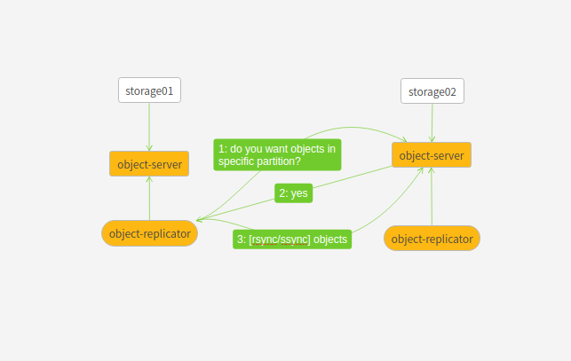

##### Replicator服务

***

由于要实现数据的高可用，replicator负责将本地存储节点的数据按需地同步到其它副本节点。

```shell
#查看某个对象的副本primary节点和handoff节点。partition=4,replica=2
swift-get-nodes -a object.ring.gz account container object
#结果
Account  	account
Container	container
Object   	object

Partition	0
Hash     	08cb7a0fd7d9e63bc3b80d061c5fc26d

Server:Port Device	192.168.56.113:6000 sdc
Server:Port Device	192.168.56.112:6000 sdb
Server:Port Device	192.168.56.113:6000 sdb	 [Handoff]
Server:Port Device	192.168.56.112:6000 sdc	 [Handoff]

```

前两个为存储对象/account/container/object的primary节点，后两个则为handoff节点。handoff节点是为了防止primary节点宕机导致服务不可用。比如，如果[Server:Port Device	192.168.56.113:6000 sdc]宕机，则该对象会存储到[Server:Port Device	192.168.56.113:6000 sdb	 [Handoff]]，如果[Server:Port Device	192.168.56.113:6000 sd]】存储服务恢复后，replicator会将增量数据同步到该节点。

> replicator的大致工作流



replicator同步数据是以partition为单位。它将partition下的所有对象的timestamp打包发送到storage02，storage02会将timestamp与自身对象的timestamp比较，如果不是最新的，则告诉storage01节点，storage01节点将该对象同步到storage02。partition分为primary parttion和handoff partition，同步这两种partition是有区别的。

同步handoff partition: replicator会将partition下的所有对象的时间戳打包发送到storage02进行比较。

同步primary partition: replicator会将自己与storage02节点/partition/suffix hash不同suffixes下的所有/partition/suffixes/objects timestamp打包发送到storage01进行比较。


