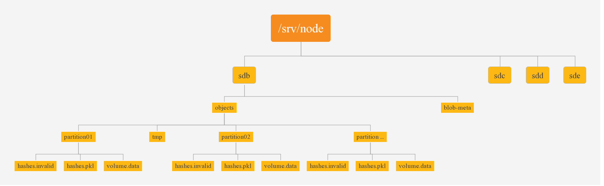

### 合并存储框架

***

先看下Openstack swift object server 工作流

首先，proxy利用object.ring.gz文件解析/account/container/object得到存储该对象副本的存储节点列表。然后将用户请求转发到该存储节点列表的Object server，Object Server通过用户请求Header中的X-Backend-Storage-Policy-Index得到对应的已经注册到Object Server中的存储引擎。该存储引擎负责该对象的存储。

##### 合并存储引擎(PackEngine)

***

合并存储引擎被命名为PackEngine，它是用golang语言实现的。它下面有对象审计服务（PackRpcAudit）、对象副本同步服务（PackRpcReplicator）、对象容器更新服务（PackUpdater）。blob-audit-deamon和blob-replicator-deamon是用Python实现，用来将swift proxy 的容器更新请求，对象副本同步请求通过Grpc调用PackEngine的对象审计服务和对象副本同步服务。

合并存储是以partition为单位，它将partition下的所有对象小文件合并到一个volume.data文件中，并在device目录下的RocksDB中记录每个对象文件在volume.data中的位置信息和元数据信息。volume.data中也保存有每个对象文件的位置信息和元数据信息，以防止在RocksDB宕机的情况下，能及时恢复DB。文件系统存储结构如下图所示

上文中的device是指图中的sdb,sdc,sdd,sde等挂载的磁盘设备，blob-meta是RocksDB数据库文件目录。总的文件系统存储结构如下图

quarantined目录是用来保存已被隔离的对象，async_pending目录是用来保存update服务更新失败的对象。