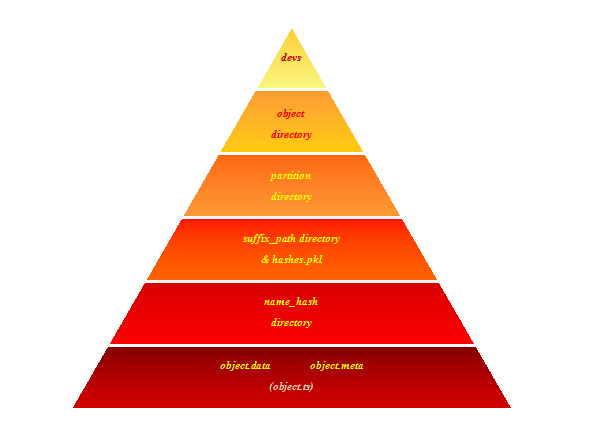
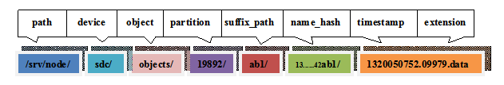
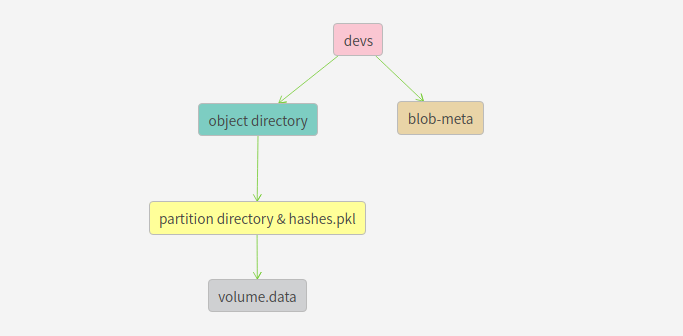
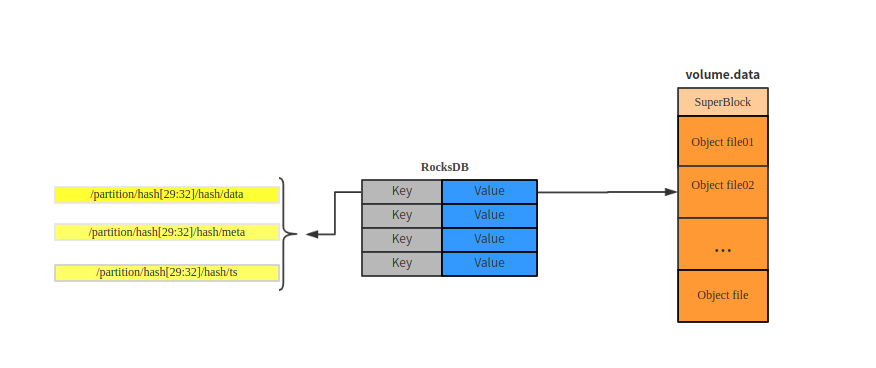
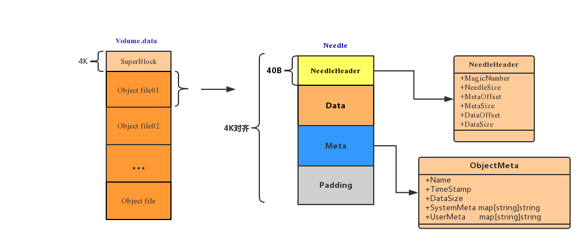
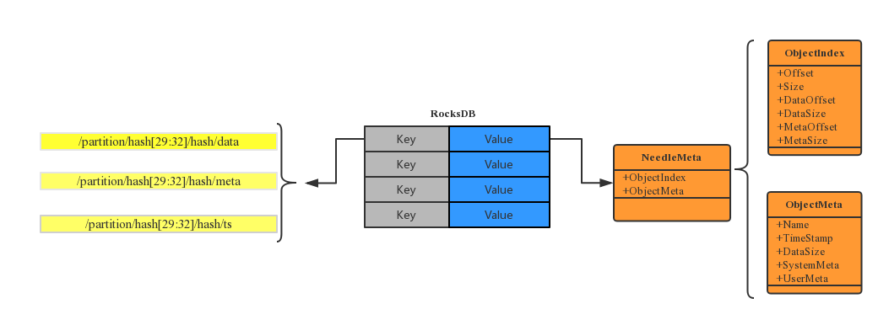
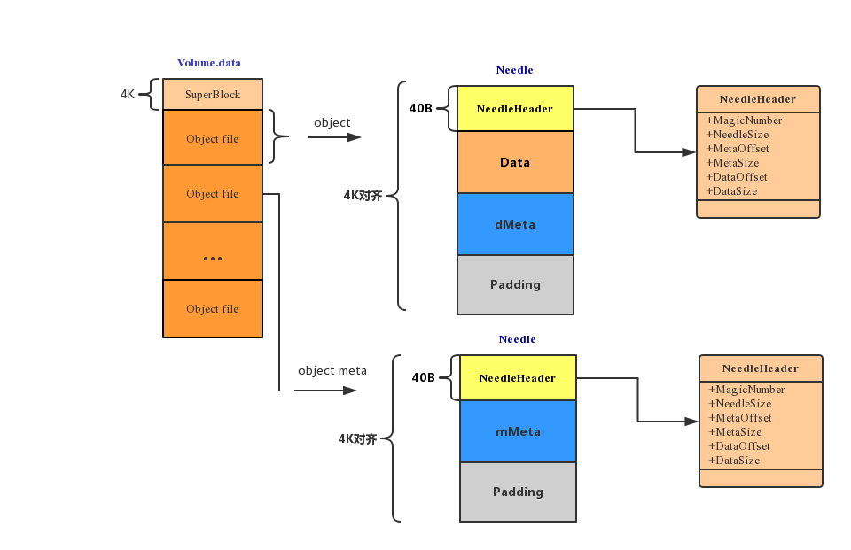

### 对象目录结构

***

##### Replication Object-Engine objects目录结构

***

在objects目录下存放的是各个partition目录，其中每个partition目录是由若干个suffix_path名的目录和一个hashes.pkl文件组成，suffix_path目录下是由object的hash_path名构成的目录，在hash_path目录下存放了关于object的数据和元数据，object存储目录的层次结构如下图所示。



例如，某object的存储路径为：/srv/node/sdc/objects/19892/ab1/136d0ab88371e25e16663fbd2ef42ab1/1320050752.09979.data



> Object数据

Object的数据存放在后缀为.data的文件中，它的metadata存放在以后缀为.meta的文件中，将被删除的Object以一个0字节后缀为.ts的文件存放。

Object path生成过程

PartShift=32-log2(partition)

objectHash=hash(suffix_hash+/account/container/object+prefix_hash)

partition=objectHash>>PartShift

suffix_path=objectHash[29:32]

name_hash=objectHash

##### Pack Object-Engine objects目录结构



关系映射图如下：



blob-meta是RocksDB数据库文件，它记录了objects目录下所有分区索引信息。当key的后缀是data时，value保存的是对象的元数据和对象在volume.data总索引；当key的后缀是meta时，value保存的是对象的元数据和post后的对象元数据在volume.data中的索引；当key的后缀是ts时，value保存的是被删除对象的元数据信息。

##### Volume.data结构

***

每个partition对应一个volume.data文件，它是partition下所有对象文件合并后的文件。如下图所示



Volume.data的前4K数据为SuperBlock，SuperBlock用来记录volume.data的元数据，现在只有数据BundleVersion=1。SuperBlock下面是每个对象，每个对象存储结构为Needle结构。如上图所示，Needle由NeedleHeader，Data，Meta，Padding四个数据块组成。NeedleHeader用来记录needle中data，meta数据块以及该needle在volume.data中的偏移位置和大小信息，NeedleHeader.MagicNumber被称为魔法数字，它用来标记一个Needle的开头。Data为对象数据。Meta保存对象元数据，它是被proto.Marshal(meta)编码后的数据。由于Needle需要4k对齐，Padding数据块起到了填充作用。

由于每个对象都合并到了一个volume.data文件中，所以PackEngine对用户的GET,PUT,COPY,DELETE,HEAD,POST等对对象的操作请求有相应的处理方法。下面先了解下数据库的存储结构。

##### RocksDB 结构

***



key值分为三种，分别是data，meta，ts 。data key的value保存对象在volume.data中的偏移位置、大小以及对象元数据信息。meta key的value只保存post更新的对象元数据信息，ts key的value保存删除后对象的元数据信息。如上图所示，Value为NeedleMeta结构体。其中，NeedleMeta.ObjectIndex与NeedleHeader功能相似，它用来查找对象也即Needle在Volume.data中的偏移位置，以及该对象的data，meta在volume.data中偏移量和大小。NeedleMeta.ObjectMeta用来保存对象元数据，它是被proto.Marshal(meta)编码后的数据。

##### OBJECT PUT/GET/POST/DELETE/HEAD/COPY

***

在对对象GET/PUT/POST/DELETE/HEAD/COPY操作时，都会先使用LoadObjectMeta(packObject)函数填充PackObject结构体。PackObject结构体记录该对象文件是否已经存在以及如果存在，则加载该对象文件的具体信息。PackObject结构体如下

```go
type PackObject struct {
	meta     *ObjectMeta //如果ts key存在，则保存该key的value
	metadata map[string]string 
	name      string // 对象名
  	key       string // 格式为partition/hash[29:32]/hash
	exists    bool   // 对象是否已经存在
	partition string // 对象所在的分区
	device    *PackDevice //使用它来操作rocksDB和bundles
	buf       *bytes.Buffer //用来保存对象数据
	dataSize  int64  //对象数据大小
	dataIndex *ObjectIndex //如果db中data key存在，则dataIndex=value.objectIndex。它是记录对象在volume中的位置
	metaIndex *ObjectIndex //如果db中meta key存在，则metaIndex=value.objectIndex。它是记录对象Meta在volume中的位置。
	dMeta *ObjectMeta //和dataIndex配合使用，保存object的元数据
	mMeta *ObjectMeta //和metaIndex配合使用，保存object meta的元数据
}
```

下面看下dMeta和mMeta具体指的什么



volume.data中object file分为两类，一类是通过put提交的，另一类是post提交的。根据Openstack swift官方API文档，put是创建对象或者替换对象操作，post是更新对象元数据操作(序列图见下图)。put提交的object暂且就叫data needle，post提交的obejct meta暂且就叫meta needle。合并存储引擎是以volume.data末尾追加的方式创建对象。当替换对象时，如果在原来对象磁盘空间上修改数据，则可能会覆盖其他对象，所以替换对象也是通过追加的方式在volume.data末尾重新创建对象；原来对象占用的磁盘空间以4k对齐通过[punch hole](http://manpages.courier-mta.org/htmlman1/fallocate.1.html)方式被回收。同理，当更新对象元数据时，如果直接在data Needle修改meta也可能会造成下一个对象数据被覆盖。所以，当post object时，PackEngine则会在volume.data末尾追加meta needle数据，RocksDB中会创建或者更新key，key=/partition/hash[29:32]/hash/meta，value.ObjectIndex跟NeedleHeader功能相似，value.objectMeta存储的是meta needle 的mMeta。所以在对象真正的存储前，先使用LoadObjectMeta(packObject)函数填充PackObject结构体，以记录该对象的状态信息。通过索引数据库，如果对象存在则packObject.exists=true，否则为false。如果ts key 存在，即对象已经被删除，则packObject.meta = ts key =>value.objcetMeta；如果data key存在，即对象存在，则packObject.dataIndex = data key -> value.objectIndex，packObject.dMeta = data key -> value.objectMeta；如果Meta key存在packObject.metaIndex = meta key -> value.objectIndex，packObject.mMeta = meta key -> value.objectMeta。