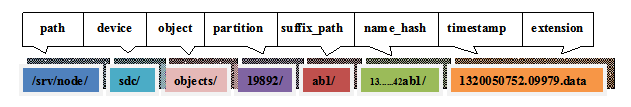
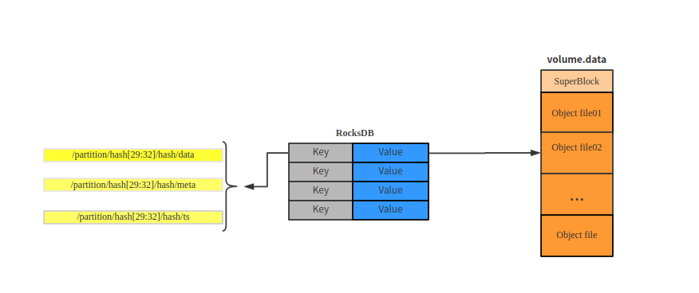
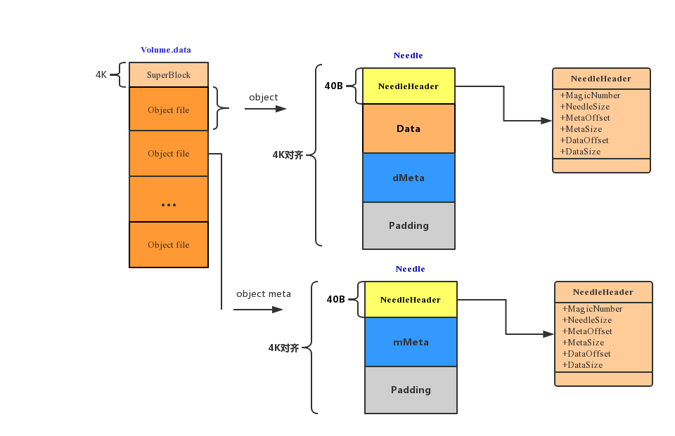
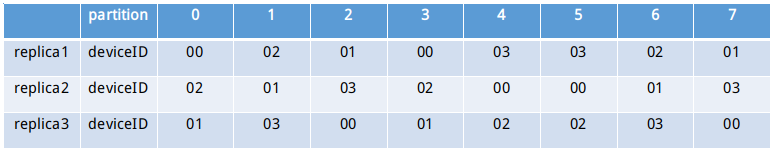

###  什么是合并存储引擎？

***

先看下存储引擎在Openstack Swift框架中的位置


用户通过Openstack swift提供的[Object Storage API](https://developer.openstack.org/api-ref/object-store/)向proxy投递对象操作请求，proxy转发请求到存储该对象的存储节点ObjectServer，ObjectServer调用存储引擎将该对象存储到磁盘。objectEngine是负责将对象存储到磁盘，以及对象在文件系统里的存储组织结构。

ObjectEngine-policy=replication存储组织结构


从上图可以看出，当存储引擎访问一个对象文件时，它需要访问6层目录。

合并存储引擎存储组织结构


从上图可以看出，当合并存储引擎访问一个对象文件时，它只需要访问4层目录。合并存储引擎将5,6层目录和文件合并存储到对应第4层的volume.data文件中。

### 为什么要使用合并存储引擎？

***

合并存储是一种海量小文件存储方案。它用来存储生产环境中产生的大量日志，图片，文档，视频切片等小文件。如果使用原生的Openstack swift存储这些大量小文件，它不仅会耗费文件系统的大量inode节点，造成磁盘空间浪费；而且，由于它会为这些大量小文件创建大量的文件目录，而当objEngine,auditer,replicator,updater每一次索引这些文件时，它们都会遍历整个目录，从而会造成整个存储引擎性能降低。合并存储为了解决上述问题，它被设计为以partition为单位，将partition下的所有对象小文件合并到一个volume.data文件中，并在key-value数据库中建立对应的索引信息。

### 合并存储框架

***

先看下Openstack swift object server 工作流


首先，proxy利用object.ring.gz文件解析/account/container/object得到存储该对象副本的存储节点列表。然后将用户请求转发到该存储节点列表的Object server，Object Server通过用户请求Header中的X-Backend-Storage-Policy-Index得到对应的已经注册到Object Server中的存储引擎。该存储引擎负责该对象的存储。

##### 合并存储引擎(PackEngine)

***


合并存储引擎被命名为PackEngine，它是用golang语言实现的。它下面有对象审计服务（PackRpcAudit）、对象副本同步服务（PackRpcReplicator）、对象容器更新服务（PackUpdater）。blob-audit-deamon和blob-replicator-deamon是用Pythone实现，用来将原生swift proxy 的容器更新请求，对象副本同步请求经过适配后，投递到PackEngine的对象审计服务和对象副本同步服务。

合并存储是以partition为单位，它将partition下的所有对象小文件合并到一个volume.data文件中，并在device下的RocksDB中记录objects/partitions中的每个对象文件在partition/volume.data中的位置信息和元数据信息。volume.data中也保存有每个对象文件的位置信息和元数据信息，以防止在RocksDB宕机的情况下，能及时恢复DB。文件系统存储结构如下图所示


上文中的device是指图中的sdb,sdc,sdd,sde等挂载的磁盘设备，blob-meta是RocksDB数据库文件目录。总的文件系统存储结构如下图


quarantined目录是用来保存已被隔离的对象，async_pending目录是用来保存update服务更新失败的对象。

##### PackEngine设计

***


首先PackEngine会初始化PackDevicesMgr对象，PackDevicesMgr负责管理对应storage-policy下所有PackDevice列表，每个PackDevice负责管理device下的所有的Bundles列表和DB，每个Bundle负责管理partition。然后PackEngine初始化PackRpcServer对象，将PackDevicesMgr注册到PackRpcServer对象中的PackDevicesMgrs字典中。类图如下图所示


用例图如下


首先向ObjectServer注册PackEngineConstructor，即注册名字为pack的合并存储引擎。

```go
func init() {
	RegisterObjectEngine("pack", PackEngineConstructor)
}
```

ObjectServer根据swift.conf配置文件中用户配置的存储引擎，初始化对应的已经注册的objEngine。

```go
	server.objEngines = make(map[int]ObjectEngine)
	for _, policy := range conf.LoadPolicies() {
		if newEngine, err := FindEngine(policy.Type); err != nil {
			return "", 0, nil, nil, fmt.Errorf("Unable to find object engine type %s: %v", policy.Type, err)
		} else {
			server.objEngines[policy.Index], err = newEngine(serverconf, policy, flags)
			if err != nil {
				return "", 0, nil, nil, fmt.Errorf("Error instantiating object engine type %s: %v", policy.Type, err)
			}
		}
	}
```


PackEngineConstructor构造器负责创建packEngine，它根据传入的conf，policy参数初始化PackObjectFactory对象。PackObjectFactory实现了objEngine接口，负责PackEngine功能。PackEngineConstructor构造器首先初始化PackDeviceMgr，然后初始化pack replicator rpc ，将PackDeviceMgr注册到rpc。最后利用协程启动rpc，go rpc.start()，并返回PackObjectFactory对象。

```go
func PackEngineConstructor(config conf.Config, policy *conf.Policy,
	flags *flag.FlagSet) (ObjectEngine, error) {

	driveRoot := config.GetDefault("app:object-server", "devices", "/srv/node")
	prefix, suffix, err := conf.GetHashPrefixAndSuffix()
	if err != nil {
		return nil, errors.New("Unable to load hashpath prefix and suffix")
	}

	port := int(config.GetInt("app:object-server", "bind_port", 6000))

	bdm := NewPackDeviceMgr(port, driveRoot, policy.Index)
	if bdm == nil {
		panic("failed to load pack device manager")
	}

	rpcPort := int(config.GetInt("app:object-server", "rpc_port", 60000))
	rpc, ok := rpcServers[port]
	if !ok {
		rpc = NewRpcServer(rpcPort)
		// Each rpc server is identified by object port instead of rpc port
		rpcServers[port] = rpc
		go rpc.start()
	}
	rpc.RegisterPackDeviceMgr(bdm)

	return &PackObjectFactory{
		driveRoot:  driveRoot,
		policy:     policy.Index,
		hashPrefix: prefix,
		hashSuffix: suffix,

		deviceMgr: bdm,
	}, nil
}
```

func NewPackDeviceMgr(port int, driveRoot string, policy int) *PackDeviceMgr

```go
func NewPackDeviceMgr(port int, driveRoot string, policy int) *PackDeviceMgr {
	dm := &PackDeviceMgr{
		DriveRoot: driveRoot,
		Policy:    policy,
		Port:      port,
		devices: make(map[string]*PackDevice),
	}
	dm.loadPackDevices(policy)
	go dm.monitorDisks()
	return dm
}

func (dm *PackDeviceMgr) loadPackDevices(policy int) {
	hashPathPrefix, hashPathSuffix, err := conf.GetHashPrefixAndSuffix()
	if err != nil {
		panic(err)
	}
	ring, err := ring.GetRing("object", hashPathPrefix, hashPathSuffix, policy)
	if err != nil {
		panic(err)
	}

	devs, err := ring.LocalDevices(dm.Port)
	if err != nil {
		glogger.Error("unable to get local device list", zap.Int("port", dm.Port))
		panic(err)
	}

	for _, dev := range devs {
		dm.devices[dev.Device] = NewPackDevice(dev.Device, dm.DriveRoot, policy)
	}
}
```

func NewPackDevice(device, driveRoot string, policy int) 

```go
func NewPackDevice(device, driveRoot string, policy int) *PackDevice {
	var err error

	dd := path.Join(driveRoot, device)
	if err = os.MkdirAll(dd, 0755); err != nil {
		glogger.Error("unable to create device directory",
			zap.String("dir", dd),
			zap.Error(err))
		return nil
	}

	op, dp := PackDevicePaths(device, driveRoot, policy)
	d := &PackDevice{
		driveRoot:  driveRoot,
		device:     device,
		policy:     policy,
		objectsDir: op,
		bundles:    make(map[string]*Bundle),
	}

	opts := gorocksdb.NewDefaultOptions()
	opts.SetCreateIfMissing(true)
	opts.SetWalSizeLimitMb(64)

	d.db, err = gorocksdb.OpenDb(opts, dp)
	if err != nil {
		glogger.Error("failed to open meta database",
			zap.String("database", dp),
			zap.Error(err))
		return nil
	}
	d.wopt = gorocksdb.NewDefaultWriteOptions()
	d.wopt.SetSync(true)
	d.ropt = gorocksdb.NewDefaultReadOptions()

	return d
}
```

func OpenBundle(devPath, partition string) (*Bundle, error)

```go
func OpenBundle(devPath, partition string) (*Bundle, error) {
	vpd := path.Join(devPath, partition)
	if err := os.MkdirAll(vpd, 0755); err != nil {
		glogger.Error("unable to create bundle directory",
			zap.String("bundle-dir", vpd), zap.Error(err))
		return nil, err
	}

	vp := path.Join(vpd, "volume.data")

	if err := formatBundleFile(vp); err != nil {
		return nil, err
	}

	vf, err := os.OpenFile(vp, os.O_RDWR|os.O_SYNC, BundleFileMode)
	if err != nil {
		glogger.Error("unable to open bundle",
			zap.String("bundle-file", vp), zap.Error(err))
		return nil, err
	}

	if _, err = vf.Seek(0, 0); err != nil {
		glogger.Error("unable to seek to begin of bundle",
			zap.String("bundle-file", vp), zap.Error(err))
		return nil, err
	}

	header := make([]byte, SuperBlockSize)
	if _, err = vf.Read(header); err != nil {
		glogger.Error("cannot read bundle super block",
			zap.String("bundle-file", vp), zap.Error(err))
		return nil, err
	}
	sb := NewSuperBlock(header)

	b := &Bundle{
		sb,Message1
		vf,
		sync.Mutex{},
		partition,
	}

	return b, nil
}
```


##### Replication Object-Engine objects目录结构

***

在objects目录下存放的是各个partition目录，其中每个partition目录是由若干个suffix_path名的目录和一个hashes.pkl文件组成，suffix_path目录下是由object的hash_path名构成的目录，在hash_path目录下存放了关于object的数据和元数据，object存储目录的层次结构如下图所示。


例如，某object的存储路径为：/srv/node/sdc/objects/19892/ab1/136d0ab88371e25e16663fbd2ef42ab1/1320050752.09979.data



Object数据

Object的数据存放在后缀为.data的文件中，它的metadata存放在以后缀为.meta的文件中，将被删除的Object以一个0字节后缀为.ts的文件存放。

Object path生成过程

PartShift=32-log2(partition)

objectHash=hash(suffix_hash+/account/container/object+prefix_hash)

partition=objectHash>>PartShift

suffix_path=objectHash[29:32]

name_hash=objectHash

##### Pack Object-Engine objects目录结构


关系映射图如下：



blob-meta是RocksDB数据库文件，它记录了objects目录下所有分区索引信息。当key的后缀是data时，value保存的是对象的元数据和对象在volume.data总索引；当key的后缀是meta时，value保存的是对象的元数据和post后的对象元数据在volume.data中的索引；当key的后缀是ts时，value保存的是被删除对象的元数据信息。

##### Volume.data结构

***

每个partition对应一个volume.data文件，它是partition下所有对象文件合并后的文件。如下图所示


Volume.data的前4K数据为SuperBlock，SuperBlock用来记录volume.data的元数据，现在只有数据BundleVersion=1。SuperBlock下面是每个对象，每个对象存储结构为Needle结构。如上图所示，Needle由NeedleHeader，Data，Meta，Padding四个数据块组成。NeedleHeader用来记录needle中data，meta数据块以及该needle在volume.data中的偏移位置和大小信息，NeedleHeader.MagicNumber被称为魔法数字，它用来标记一个Needle的开头。Data为对象数据。Meta保存对象元数据，它是被proto.Marshal(meta)编码后的数据。由于Needle需要4k对齐，Padding数据块起到了填充作用。

由于每个对象都合并到了一个volume.data文件中，所以PackEngine对用户的GET,PUT,COPY,DELETE,HEAD,POST等对对象的操作请求有相应的处理方法。下面先了解下数据库的存储结构。

##### RocksDB 结构

***


key值分为三种，分别是data，meta，ts 。data key的value保存对象在volume.data中的偏移位置、大小以及对象元数据信息。meta key的value只保存post更新的对象元数据信息，ts key的value保存删除后对象的元数据信息。如上图所示，Value为NeedleMeta结构体。其中，NeedleMeta.ObjectIndex与NeedleHeader功能相似，它用来查找对象也即Needle在Volume.data中的偏移位置，以及该对象的data，meta在volume.data中偏移量和大小。NeedleMeta.ObjectMeta用来保存对象元数据，它是被proto.Marshal(meta)编码后的数据。

##### OBJECT PUT/GET/POST/DELETE/HEAD/COPY

***

在对对象GET/PUT/POST/DELETE/HEAD/COPY操作时，都会先使用LoadObjectMeta(packObject)函数填充PackObject结构体。PackObject结构体记录该对象文件是否已经存在以及如果存在，则加载该对象文件的具体信息。PackObject结构体如下

```go
type PackObject struct {
	meta     *ObjectMeta //如果ts key存在，则保存该key的value
	metadata map[string]string 
	name      string // 对象名
  	key       string // 格式为partition/hash[29:32]/hash
	exists    bool   // 对象是否已经存在
	partition string // 对象所在的分区
	device    *PackDevice //使用它来操作rocksDB和bundles
	buf       *bytes.Buffer //用来保存对象数据
	dataSize  int64  //对象数据大小
	dataIndex *ObjectIndex //如果db中data key存在，则dataIndex=value.objectIndex。它是记录对象在volume中的位置
	metaIndex *ObjectIndex //如果db中meta key存在，则metaIndex=value.objectIndex。它是记录对象Meta在volume中的位置。
	dMeta *ObjectMeta //和dataIndex配合使用，保存object的元数据
	mMeta *ObjectMeta //和metaIndex配合使用，保存object meta的元数据
}
```

下面看下dMeta和mMeta具体指的什么



volume.data中object file分为两类，一类是通过put提交的，另一类是post提交的。根据Openstack swift官方API文档，put是创建对象或者替换对象操作，post是更新对象元数据操作(序列图见下图)。put提交的object暂且就叫data needle，post提交的obejct meta暂且就叫meta needle。合并存储引擎是以volume.data末尾追加的方式创建对象。当替换对象时，如果在原来对象磁盘空间上修改数据，则可能会覆盖其他对象，所以替换对象也是通过追加的方式在volume.data末尾重新创建对象；原来对象占用的磁盘空间以4k对齐通过[punch hole](http://manpages.courier-mta.org/htmlman1/fallocate.1.html)方式被回收。同理，当更新对象元数据时，如果直接在data Needle修改meta也可能会造成下一个对象数据被覆盖。所以，当post object时，PackEngine则会在volume.data末尾追加meta needle数据，RocksDB中会创建或者更新key，key=/partition/hash[29:32]/hash/meta，value.ObjectIndex跟NeedleHeader功能相似，value.objectMeta存储的是meta needle 的mMeta。所以在对象真正的存储前，先使用LoadObjectMeta(packObject)函数填充PackObject结构体，以记录该对象的状态信息。通过索引数据库，如果对象存在则packObject.exists=true，否则为false。如果ts key 存在，即对象已经被删除，则packObject.meta = ts key =>value.objcetMeta；如果data key存在，即对象存在，则packObject.dataIndex = data key => value.objectIndex，packObject.dMeta = data key => value.objectMeta；如果Meta key存在packObject.metaIndex = meta key => value.objectIndex，packObject.mMeta = meta key => value.objectMeta。

###### 1. GET OBJECT


根据PackObject.dataIndex，取出对象数据。

###### 2. PUT OBJECT


如果对象已经存在，先删除数据库中的ts key，meta key。然后根据PackObject.dataIndex，PackObject.metaIndex异步回收volume.data中的对象数据，同时在volume.data末尾创建对象，并更新数据库。
###### 3. POST OBJECT


如果对象meta已经存在，则根据PackObject.metaIndex异步回收volume.data中的对象数据，同时在volume.data末尾创建对象 meta，并更新数据库。

###### 4. DELETE OBJECT


先删除数据库中的data key，meta key。根据PackObject.dataIndex，PackObject.metaIndex异步回收volume.data中的对象数据。同时，在数据库中创建ts key。

###### 5. HEAD OBJECT


根据PackObject.metaIndex，取出对象元数据。

###### 6. COPY OBJECT


根据PackObject.dataIndex取出voluem.data中的对象并复制对象数据到dsts。

### Ring文件解析

***

Swift使用[一致性哈希](http://en.wikipedia.org/wiki/Consistent_hashing)原则。它构建一个叫ring的文件。一个ring表示partitions空间，它计算所有可能的hash值并将它们均匀地分布在每一个pratition。如下图


比如要存储一个对象文件/accout/container/object，总的partitions数目=2^5，计算该对象要存的partition值，先做哈希digest=hash("prefix_hash+account+container+object+suffix_hash"),然后
partition=(digest[0])<<24 | uint64(digest[1])<<16 | uint64(digest[2])<<8 | uint64(digest[3]))>>(32-5)。

Ring的作用：

```shell
1.  根据每个DC配置的weight将partition均匀地散落在每一块DC
2.  使对象均匀散落在每一个partition
3.  存储节点的动态扩容
4.  存储节点之间数据同步
5.  路由（通过ring可以找到对象的partition，device）
```

如何生成object.ring:

```shell
 #第一个3: partition数目(2^3)
 #第二个3: replica数目（3副本）
 #第三个1: 距离下一次平衡ring需要的时间（单位小时）
 swift-ring-builder object.builder create 3 3 1
 #添加region/zone/ip:port/device到object.ring,weight代表该device的权重，该值越大device分的partition越多
 swift-ring-builder object.builder add --region 1 --zone 1 --ip 127.0.0.1 --port 6000 --device sdb --weight 100
 swift-ring-builder object.builder add --region 1 --zone 1 --ip 127.0.0.1 --port 6000 --device sdc --weight 100
 swift-ring-builder object.builder add --region 1 --zone 2 --ip 127.0.0.1 --port 6000 --device sdd --weight 100
swift-ring-builder object.builder add --region 1 --zone 2 --ip 127.0.0.1 --port 6000 --device sde --weight 100
#添加完device后，需要平衡ring
swift-ring-builder object.builder rebalance
```

​	

构建Ring原理：

ZONE=1的情况

***

object.ring: 分区数为8，副本数为3，设备数为4，一个region，一个zone。

```shell
#swift-ring-builder object.builder 
8 partitions, 3.000000 replicas, 1 regions, 1 zones, 4 devices, 0.00 balance, 0.00 dispersion
The minimum number of hours before a partition can be reassigned is 1 (0:00:00 remaining)
The overload factor is 0.00% (0.000000)
Devices:   id region zone ip address:port replication ip:port  name weight partitions balance flags meta
            0      1    1  127.0.0.1:6000      127.0.0.1:6000   sdb 100.00          6    0.00       
            1      1    1  127.0.0.1:6000      127.0.0.1:6000   sdc 100.00          6    0.00       
            2      1    1  127.0.0.1:6000      127.0.0.1:6000   sdd 100.00          6    0.00       
            3      1    1  127.0.0.1:6000      127.0.0.1:6000   sde 100.00          6    0.00  
```

devices分布图：


分析：

​	因为8个partition，3个replica，所以每个device分得6个partition。所以上图中的每个deviceID随机出现六次。可以理解为下图


可以理解为依次轮循先从zone1中不放回随机地抽取device作为partition replica1下的deviceID,replica2下的deviceID，replica3下的deviceID。依次类推抽取partition[0-7]。

ZONE=2的情况

***

```shell
#swift-ring-builder object.builder 
8 partitions, 3.000000 replicas, 1 regions, 2 zones, 4 devices, 0.00 balance, 0.00 dispersion
The minimum number of hours before a partition can be reassigned is 1 (0:00:00 remaining)
The overload factor is 0.00% (0.000000)
Ring file object.ring.gz not found, probably it hasn't been written yet
Devices:   id region zone ip address:port replication ip:port  name weight partitions balance flags meta
            0      1    1  127.0.0.1:6000      127.0.0.1:6000   sdb 100.00          6    0.00       
            1      1    1  127.0.0.1:6000      127.0.0.1:6000   sdc 100.00          6    0.00       
            2      1    2  127.0.0.1:6000      127.0.0.1:6000   sdd 100.00          6    0.00       
            3      1    2  127.0.0.1:6000      127.0.0.1:6000   sde 100.00          6    0.00     
```

devices分布图：



因为8个partition，3个replica，所以每个device分得6个partition。所以上图中的每个deviceID随机出现六次。可以理解为下图


可以理解为依次轮循先从zone1和zone2中不放回随机地抽取device作为partition replica1下的deviceID,replica2下的deviceID，replica3下的deviceID。依次类推抽取partition[0-7]。

Device权重

***

如果device的容量不等，可以通过配置device的weight来调节分配的partition的数量。比如一组设备sdb=50G,sdc=50,sdd=100G,sde=100G。由于sdb,sdc的容量是sdd,sde的一半，所以可以将sdb,sdc的weight调整到50，sdd,sde的weight为100。命令如下：

```shell
 #第一个3: partition数目(2^3)
 #第二个3: replica数目（3副本）
 #第三个1: 距离下一次平衡ring需要的时间（单位小时）
 swift-ring-builder object.builder create 3 3 1
 #添加region/zone/ip:port/device到object.ring,weight代表该device的权重，该值越大device分的partition越多,最多为partitionNum
 swift-ring-builder object.builder add --region 1 --zone 1 --ip 127.0.0.1 --port 6000 --device sdb --weight 50
 swift-ring-builder object.builder add --region 1 --zone 1 --ip 127.0.0.1 --port 6000 --device sdc --weight 50
 swift-ring-builder object.builder add --region 1 --zone 2 --ip 127.0.0.1 --port 6000 --device sdd --weight 100
swift-ring-builder object.builder add --region 1 --zone 2 --ip 127.0.0.1 --port 6000 --device sde --weight 100
#添加完device后，需要平衡ring
swift-ring-builder object.builder rebalance
```

```shell
8 partitions, 3.000000 replicas, 1 regions, 2 zones, 4 devices, 0.00 balance, 0.00 dispersion
The minimum number of hours before a partition can be reassigned is 1 (0:59:51 remaining)
The overload factor is 0.00% (0.000000)
Ring file object.ring.gz is up-to-date
Devices:   id region zone ip address:port replication ip:port  name weight partitions balance flags meta
            0      1    1  127.0.0.1:6000      127.0.0.1:6000   sdb  50.00          4    0.00       
            1      1    1  127.0.0.1:6000      127.0.0.1:6000   sdc  50.00          4    0.00       
            2      1    2  127.0.0.1:6000      127.0.0.1:6000   sdd 100.00          8    0.00       
            3      1    2  127.0.0.1:6000      127.0.0.1:6000   sde 100.00          8    0.00   
```


rebalance Ring

***

Ring创建并添加完节点后，要rebalance Ring。举个例子：

```shell
partition=8
replica=3
#device权重配比
id=0 192.168.56.2:6000 sdb weight=50  zone=1
id=1 192.168.56.2:6000 sdc weitht=50  zone=1
id=2 192.168.56.3:6000 sdb weight=50  zone=2
id=3 192.168.56.3:6000 sdc weight=200  zone=2
#常见的错误理解
id_0=50/(50+50+50+200)*partition*replica=3.4285714285714284
id_1=50/(50+50+50+200)*partition*replica=3.4285714285714284
id_2=50/(50+50+50+200)*partition*replica=3.4285714285714284
id_3=50/(50+50+50+200)*partition*replica=13.714285714285714
#平衡的过程:它将weightedReplica=(single_weight)*replicas/all_weight，将weightedReplica>1的device weightedReplica置1，然后根据平衡树的每层weightedReplica按照平衡算法将device溢出的分配到其他device。也就是说无论device的weight配置多么大，它所占用的weightedReplica最大不超过1。平衡后的结果如下：
id_0=6
id_1=5
id_2=5
id_3=8
```

平衡树示意图如下：


##### Replicator服务

***

由于要实现数据的高可用，replicator负责将自身的数据按需地同步到其它副本节点。

```shell
#查看某个对象的副本primary节点和handoff节点。partition=4,replica=2
swift-get-nodes -a object.ring.gz account container object
#结果
Account  	account
Container	container
Object   	object

Partition	0
Hash     	08cb7a0fd7d9e63bc3b80d061c5fc26d

Server:Port Device	192.168.56.113:6000 sdc
Server:Port Device	192.168.56.112:6000 sdb
Server:Port Device	192.168.56.113:6000 sdb	 [Handoff]
Server:Port Device	192.168.56.112:6000 sdc	 [Handoff]
#前两个为存储对象/account/container/object的primary节点，后两个则为handoff节点。handoff节点是为了防止primary节点宕机导致服务不可用。比如，如果【Server:Port Device	192.168.56.113:6000 sdc】宕机，则该对象会存储到【Server:Port Device	192.168.56.113:6000 sdb	 [Handoff]】，如果【Server:Port Device	192.168.56.113:6000 sdc】存储服务恢复后，replicator会将增量数据同步到该节点。
```

replicator的大致工作流


replicator同步数据是以partition为单位。它将partition下的所有对象的timestamp打包发送到storage02，storage02会将timestamp与自身对象的timestamp比较，如果不是最新的，则告诉storage01节点，storage01节点将该对象同步到storage02。partition分为primary parttion和handoff partition，同步这两种partition是有区别的。

同步handoff partition: replicator会将partition下的所有对象的时间戳打包发送到storage02进行比较。

同步primary partition: replicator会将自己与storage02节点/partition/suffix hash不同suffixes下的所有/partition/suffixes/objects timestamp打包发送到storage01进行比较。


